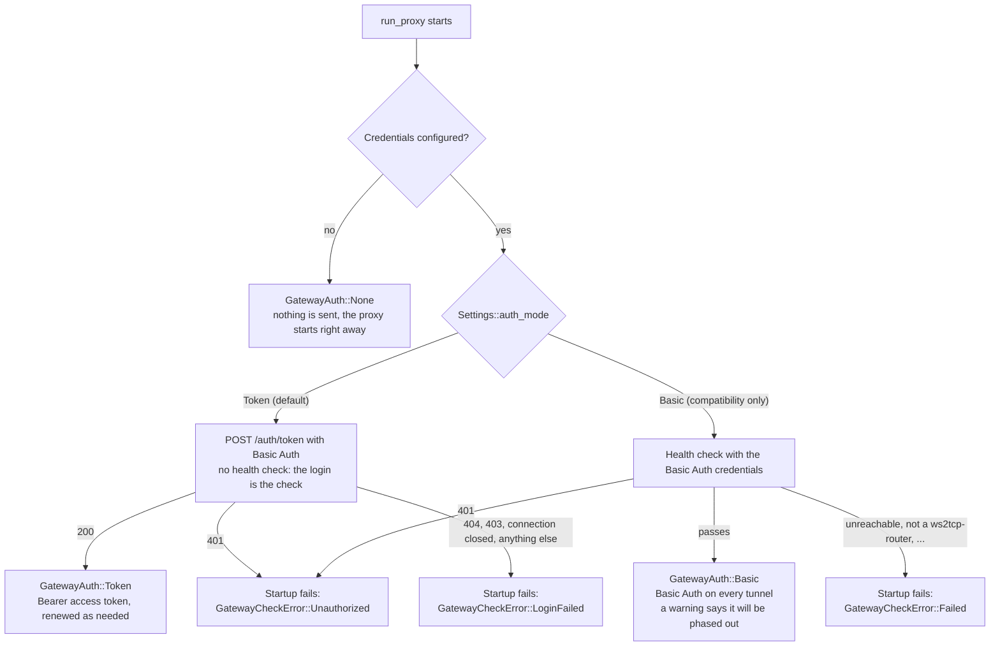
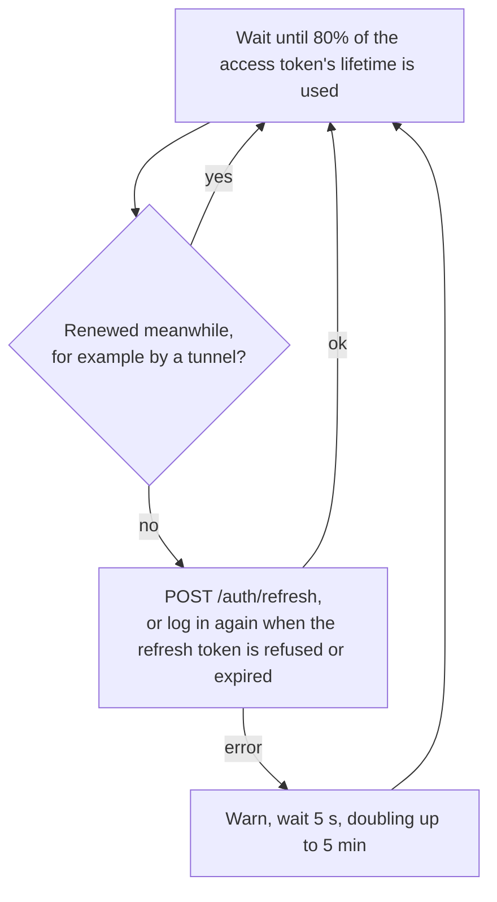
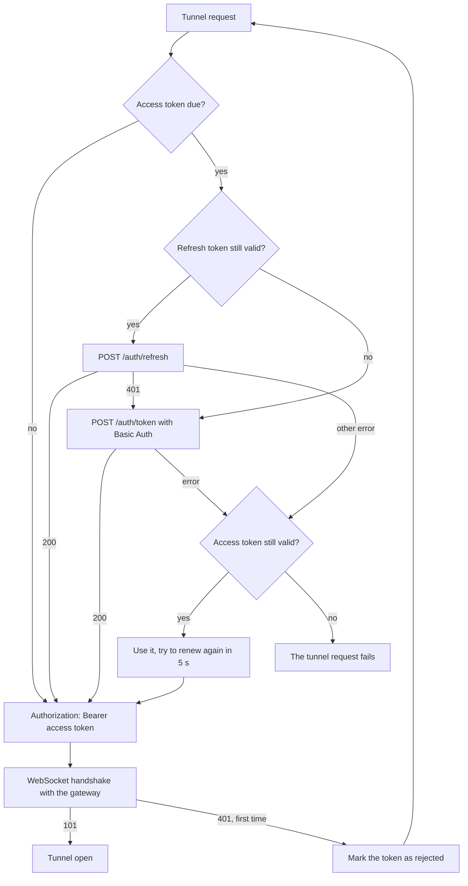

# ws2tcp-local-core

Core Rust library for `ws2tcp-local`.

This crate contains the proxy service, settings resolution, routing rules,
gateway handling, TLS setup, and TCP/WebSocket tunnel implementation used by the
CLI, FFI, and GUI frontends.

## Usage

```rust
use ws2tcp_local_core::{Settings, SettingsOverrides, run_proxy};

# async fn example() -> anyhow::Result<()> {
let settings = Settings::resolve(SettingsOverrides {
    gateway: Some("wss://example.com".to_owned()),
    ..SettingsOverrides::default()
})?;

run_proxy(settings, async {}).await?;
# Ok(())
# }
```

`run_proxy` first checks the gateway (a websocket handshake on the gateway root,
answered by `ws2tcp-router`'s health check) before loading routing rules or
binding any port. When the check fails, the returned `anyhow::Error` wraps a
`GatewayCheckError`:

```rust
# async fn example(settings: ws2tcp_local_core::Settings) -> anyhow::Result<()> {
use ws2tcp_local_core::{GatewayCheckError, run_proxy};

if let Err(err) = run_proxy(settings, async {}).await {
    match err.downcast_ref::<GatewayCheckError>() {
        Some(GatewayCheckError::Unauthorized { .. }) => eprintln!("wrong credentials: {err}"),
        Some(GatewayCheckError::Failed(_)) => eprintln!("gateway unusable: {err}"),
        None => return Err(err),
    }
}
# Ok(())
# }
```

## Gateway authentication

The client authenticates to the gateway with exactly one method at a time, chosen with
`Settings::auth_mode`. The default is `Token`. `Basic` (a health check, then Basic Auth on every
connection) is kept only for compatibility with gateways that have no token authentication; it
logs a warning on startup and is to be phased out. Without credentials authentication is not
enabled: nothing is sent at startup, in either mode, and the proxy starts right away.

At startup:



In token mode there is no fallback to Basic Auth. A background task renews the access token on
its own once 80% of its lifetime is used, so that neither the application nor the tunnels have to
wait for it. It ends with the session, never asks more often than once a second, and after a
failure tries again after 5 seconds, doubling up to 5 minutes:



Every tunnel still checks the token when it opens (`GatewayAuth::authorization`), as a safety
net for a renewal that failed or has not happened yet. It renews first when the token is due,
and concurrent tunnels wait for one renewal, because a refresh token can be used only once:



Tokens are never logged, and the `Authorization` header values are marked sensitive.

## License

MIT. See [`LICENSE`](LICENSE).
