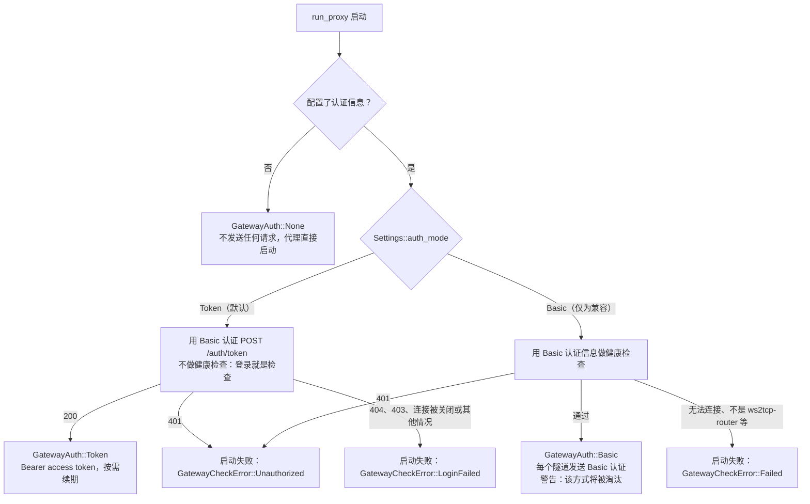
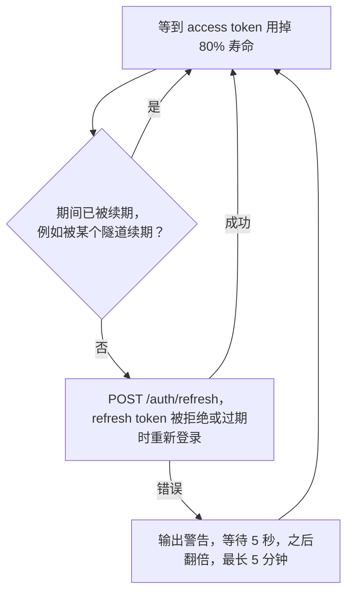
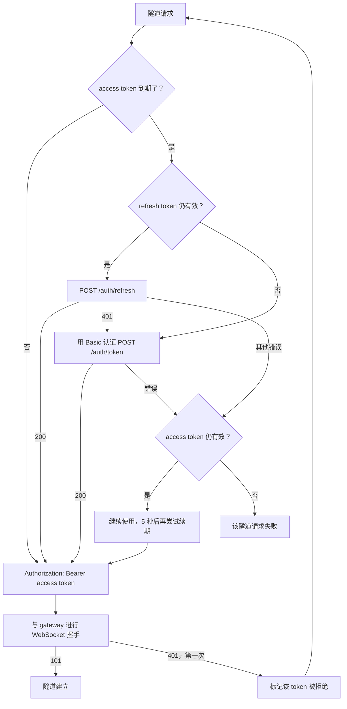

# ws2tcp-local-core

`ws2tcp-local` 的核心 Rust 库。

这个 crate 包含代理服务、配置解析、路由规则、网关处理、TLS 设置，以及
TCP/WebSocket 隧道实现，供 CLI、FFI 和 GUI 前端复用。

## 用法

```rust
use ws2tcp_local_core::{Settings, SettingsOverrides, run_proxy};

# async fn example() -> anyhow::Result<()> {
let settings = Settings::resolve(SettingsOverrides {
    gateway: Some("wss://example.com".to_owned()),
    ..SettingsOverrides::default()
})?;

run_proxy(settings, async {}).await?;
# Ok(())
# }
```

## Gateway 认证

客户端同一时间只使用一种方式向 gateway 认证，由 `Settings::auth_mode` 选择，默认是 `Token`。`Basic`（健康检查，然后每个连接发送 Basic 认证）
只是为兼容没有 token 认证的 gateway 而保留，启动时会输出警告，之后会被逐步淘汰。没有认证信息表示未开启认证：两种模式下启动时都不发送任何请求，
代理直接启动。

启动时：



token 模式不会回退到 Basic 认证。后台任务会在 access token 用掉 80% 寿命时自行续期，因此应用和隧道都不必等待续期。
它随会话结束而结束，最多每秒请求一次，失败后 5 秒重试，之后每次翻倍，最长 5 分钟：



每个隧道打开时仍会检查 token（`GatewayAuth::authorization`），作为续期失败或尚未发生时的兜底：token 到期时先续期，
并发的隧道会等待同一次续期，因为 refresh token 只能使用一次：



token 不会写入日志，`Authorization` 头的值也被标记为敏感。

## 上游代理

`Settings::upstream_proxy` 会让所有出口连接经过一个代理服务器：访问 gateway 的连接（隧道、
健康检查和 token 请求）、被路由规则判定为直连的请求，以及规则列表的下载。用
`UpstreamProxy::parse` 解析，支持 `http://`（HTTP 代理，使用 `CONNECT`）、`socks5h://`（由代理
解析域名）和 `socks5://`（在本地解析域名）URL，可带 `user:pass@` 认证信息。设置后不会读取代理
环境变量。日志和错误信息只显示代理地址，不显示认证信息。

## 许可证

MIT。见 [`LICENSE`](LICENSE)。
